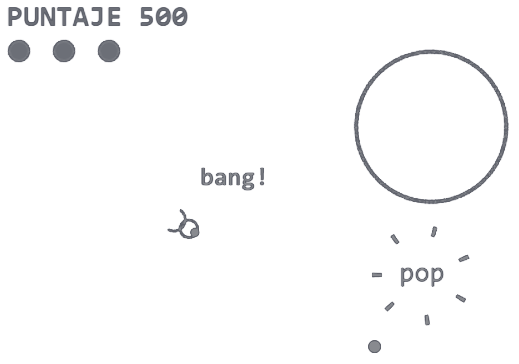

  <!--  -->
  

## PIUMCRAC
Es un juego de naves al estilo de Asteroids, con explosiones onomatopéyicas
### [O--Jugar--O](https://muinicomuiser.github.io/piumcrac---AsteroidsLike/)

## Descripción
Está desarrollado puramente en JavaScript y su interfaz en HTML y CSS.    
Usa el elemento __CANVAS__ y su interfaz __CONTEXT 2D__ para dibujar todos los objetos. La animación se genera con __requestAnimationFrame__.   
Permite cambiar el modo de la imagen, entre oscuro interespacial y claro como un papel.
